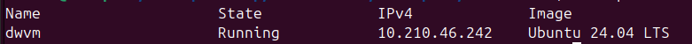

## Install Canonical Multipass

### Copy inventory.example file as inventory
```bash
cd <workbench_directory>/ansible
cp inventory.example inventory
```

### Edit Ansible inventory file 

Enter full path for workbench directory.

workbench_directory: /home/<local_user>/<local_workspace>/<local_project_dir>

example: /home/local1/workspace/workbench

<workbench_directory>/ansible/inventory
```yaml
---
prod_servers:
.....

all:
  vars:
    ansible_python_interpreter: /usr/bin/python3
    workbench_full_path: <workbench_directory>
```

### Enter local system user name
<workbench_directory>/ansible/inventory
```yaml
---
prod_servers:
.....
dev_servers:
.....
controller_pc:
  hosts:
    local:
      .....
      ansible_user: local1
.....
```


### Install Multipass
Current user must have sudo privileges.The following commands will install an apt package (python3-pip), and Canonical Multipass. And copy some config files.

```bash
cd <workbench_directory>/ansible
```

```bash
ansible-playbook workbench.yml
```
"BECOME password" is the password of the Controller PC system user.

### Create a Virtual Machine with Canonical Multipass

Edit cloud-config.yaml. Enter ssh_authorized_keys (..... represents the skipped sections). 

<workbench_directory>/multipass/cloud-init/cloud-config.yaml
```yaml
#cloud-config
.....

hostname: devserver1
fqdn: devserver1.myserver.com

# User setup configuration
users:
    .....
    # Enter the public ssh key below. Copy value from ~/.ssh/vmuserkey.pub 
    ssh_authorized_keys:
    - paste_value_here
.....
```

```bash
cd <workbench_directory>/multipass/cloud-init
```
```bash
multipass launch 24.04 --name dwvm --cpus 1 --disk 40G --memory 4G --cloud-init cloud-config.yaml
```
This will take some time.

```bash
multipass list
```


Note the IP address in the output ( IPv4 ) . We will use it in the following steps. It takes some time for VM to start. If VM state is "Restarting" then wait a few seconds, and run the command again.

Mount a local directory to the Virtual Machine
```bash
multipass mount --gid-map 1000:1000 --uid-map 1000:1000 --type=classic <workbench_directory>/dockerfiles dwvm:/home/vmuser/dockerfiles
```
The first number 1000 in 1000:1000 is my user id and group id on Controller Pc. You can see your user id, and group id with the **id** command in a terminal on Controller Pc. If your user id, and group id is different than 1000, then enter that id instead of 1000.

Back to [Development Environment](install-dev-2404.md#install-canonical-multipass)
