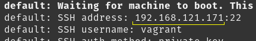
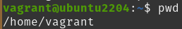
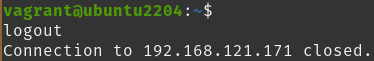

# Installation steps of development environment:

## Requirements:
  - Operating System: Ubuntu 22.04, or Pop!_OS 22.04.
  - Virtualization enabled.

Controller PC: Physical PC (Vagrant Host, Ansible Controller, Developer PC).

Vagrant VM: The virtual machine created by Vagrant in Controller PC.


### Variables:
- vagrant_ssh_key: devuser1
- local_user: local1
  - The user of your Controller PC. (Local Development PC)
- vagrant_vm_IP: 
  - Vagrant sets an IP address on the first run of the VM. 
- local_workspace: dswebdocs
  - The directory to store software source code.
- local_project_dir: workbench
  - This directory holds dswebdocs workbench project
- local_domain_name_1: site1.local
  - A domain name for local use. Defined in /etc/hosts file.
- local_domain_name_2: site2.local
  - A domain name for local use. Defined in /etc/hosts file.
- workbench_directory: /home/<local_user>/<local_workspace>/<local_project_dir>
  - Variable holds the full path to dswebdocs workbench project.

When you see these variables inside '< >' symbols through the document, enter the values valid for your setup.

### Example:

**Document:**
```bash
ping <local_domain_name_1>
```

**Use it as:**
```bash
ping site1.local
```

## Install Ansible 

```bash
sudo apt-get update
sudo apt-get install python3-pip -y
python3 -m pip install --upgrade --user ansible
```

## Install git
```bash
sudo apt install git-all -y
```

## Create a workspace directory if you don't have one

```bash
mkdir ~/<local_workspace>
```


## Clone repository

```bash
cd ~/<local_workspace>
git clone  https://github.com/dswebdocs/workbench.git
```


## Files that must be modified/checked before use:

/etc/hosts

~/<local_workspace>/<local_project_dir>/
  - ansible/inventory
  - dockerfiles/.env
  - dockerfiles/nginx1-development.env
  - dockerfiles/nginx2-development.env
  - dockerfiles/docker-compose.yml 
  - vagrant/Vagrantfile

We will edit these files through the installation process.


## Create a ssh key pair for workbench

```bash
cd ~/.ssh
ssh-keygen -t rsa 4096 -f ~/.ssh/<vagrant_ssh_key>
```
It will ask for a passphraze, you can enter one, or skip it by pressing <kbd>ENTER</kbd> . ( You will need this passphraze later, keep it safe. )

Make key pair readable/writable only by the user: 
```bash
chmod u=wr-,g=---,o=--- ~/.ssh/<vagrant_ssh_key>*
```

Add ssh key to ssh agent:
```bash
ssh-add ~/.ssh/<vagrant_ssh_key>
```

## Install Vagrant

## Copy inventory.example file as inventory
```bash
cd ~/<local_workspace>/<local_project_dir>/ansible
cp inventory.example inventory
```

Current user must have sudo privileges.

The following commands will install Vagrant, Qemu, libvirt, virt-manager, and related other packages.
```bash
cd ~/<local_workspace>/<local_project_dir>/ansible
ansible-galaxy install -r requirements.yml --force
ansible-playbook workbench.yml
```
"BECOME password" is the password of the current system user.

## Check Vagrantfile

Open ~/<local_workspace>/<local_project_dir>/vagrant/Vagrantfile, and check for the following

```bash
ssh_key_filename="<vagrant_ssh_key>"
```
The value must be equal to the ssh key name we created in "Create a ssh key pair for workbench" step.


## Run Vagrant
```bash
cd ~/<local_workspace>/<local_project_dir>/vagrant
vagrant up
```


Note the IP address in the output ( vagrant_vm_IP ) . We will use in the following steps.

## Edit /etc/hosts file
Add the following rows to the /etc/hosts file with a text editor. You must run the text editor with sudo privileges.
```bash
sudo nano /etc/hosts
```
Add the following rows to the end of file.
```bash
<vagrant_vm_IP> <local_domain_name_1>
<vagrant_vm_IP> <local_domain_name_2>
```
<kbd>CTRL</kbd> + <kbd>o</kbd> to Save (o is, as in Oscar).

<kbd>CTRL</kbd> + <kbd>x</kbd> to Exit.

Web browser is directed to this virtual machine when we enter http://<local_domain_name_1> to the address bar.

## Test Vagrant ssh login 

```bash
ssh vagrant@<vagrant_vm_IP>
```

Will ask "Are you sure you want to continue connecting (yes/no/[fingerprint])?" , write  "yes" and press <kbd>ENTER</kbd> .

If you set a passphraze for your ssh key, it may ask for the passphraze.
( It won't ask for a passphraze if you add your ssh key beforehand to ssh-agent. )

Now, we are in the Vagrant VM. Let's see the current directory.



Exit from ssh session, press <kbd>CTRL</kbd>+<kbd>D</kbd>.



Now, we are back in Controller PC .

## Start rsync-auto

Start Vagrant Virtual Machine (if not working):
```bash
cd ~/<local_workspace>/<local_project_dir>/vagrant
vagrant up
```

Open a new terminal, start rsync-auto.
```bash
cd ~/<local_workspace>/<local_project_dir>/vagrant
vagrant rsync-auto
```
rsync-auto keeps running in foreground until we exit.
rsync replicates changes from Ansible Controller to Vagrant VM.

~/<local_workspace>/<local_project_dir>/vagrant/Vagrantfile
config.vm.synced_folder sets which directory to sync.

## Stop rsync-auto
Switch to the terminal runnig synch-auto. <kbd>CTRL</kbd>+<kbd>c</kbd> to stop rsync-auto .

## Stop vagrant VM

```bash
cd ~/<local_workspace>/<local_project_dir>/vagrant
vagrant halt
```

## Edit Ansible inventory file 
~/<local_workspace>/<local_project_dir>/ansible/inventory

Enter IP address for ansible_host we noted at previous steps.

```yaml
development:
  ansible_host: <vagrant_vm_IP>
```

Check ssh key filename and path.

```yaml
development:
  ansible_ssh_private_key_file: ~/.ssh/<vagrant_ssh_key>
```

Enter full path for workbench directory.

```yaml
workbench_full_path: /home/<local_user>/<local_workspace>/<local_project_dir>
```

## Docker Compose Settings

Development and production environments differ in storage settings. Development environment uses Docker bind mounts. Bind mounts enable transfer of file changes to the related Docker container. In production this is not needed, also include security risks. 

Docker Compose Profiles seperate development and production environments in docker-compose.yml.

**Check the current environment**
Check the current environment in ~/<local_workspace>/<local_project_dir>/dockerfiles/.env file . Uncomment development row, comment out production row.
```bash
COMPOSE_PROFILES="development"
# COMPOSE_PROFILES="production"
```

**Enter your domain address in nginx1-development.env**
~/<local_workspace>/<local_project_dir>/dockerfiles/nginx1-development.env
```bash
APP_FOLDER="site1"
VIRTUAL_HOST="site1.local"
```

**Enter a second domain address in nginx2-development.env**
~/<local_workspace>/<local_project_dir>/dockerfiles/nginx2-development.env
```bash
APP_FOLDER="site2"
VIRTUAL_HOST="site2.local"
```


## Install Docker on Vagrant VM 

Add your ssh key to ssh agent
```bash
ssh-add ~/.ssh/<vagrant_ssh_key>
```

Run Vagrant VM
```bash
cd ~/<local_workspace>/<local_project_dir>/vagrant
vagrant up
```

Install Docker
```bash
cd ~/<local_workspace>/<local_project_dir>/ansible
ansible-playbook installdocker.yml -l development
```
Will ask "BECOME password" for Vagrant VM user, enter "vagrant".
Default password for vagrant user is "vagrant". We run Ansible commands on Controller PC, which make changes in Vagrant VM via a ssh connection.

Reboot the Vagrant VM to enable recently made changes.
```bash
cd ~/<local_workspace>/<local_project_dir>/vagrant
vagrant reload --provision
```

Test docker installation.
```bash
ssh vagrant@<vagrant_vm_IP>
docker run hello-world
```
Press [CTRL] + [d] to end ssh session.


## Deploy two static sites on Vagrant VM

```bash
cd ~/<local_workspace>/<local_project_dir>/vagrant
vagrant up
cd ~/<local_workspace>/<local_project_dir>/ansible
ansible-playbook dockerbuild.yml -l development
ansible-playbook dockerup.yml -l development
```

Will ask "BECOME password" for Vagrant VM user, enter "vagrant".

### Open sites on a web browser
Open a web browser, and visit the following addresses.

http://<local_domain_name_1>/

http://<local_domain_name_2>/

### Run rsync-auto
Open a new terminal, start rsync-auto.
```bash
cd ~/<local_workspace>/<local_project_dir>/vagrant
vagrant rsync-auto
```
### Edit a source file
Related source files are in:
~/<local_workspace>/<local_project_dir>/dockerfiles/site1/data
  - images directory
  - www directory

~/<local_workspace>/<local_project_dir>/dockerfiles/site2/data
  - images directory
  - www directory

Edit ~/<local_workspace>/<local_project_dir>/dockerfiles/site1/data/www/index.html file with a text editor , make some changes in content, and save the file. Open a web browser, and go to: 'http://<local_domain_name_1>' .
Refresh the page: <kbd>SHIFT</kbd>+<kbd>F5</kbd> function key.
If same page comes, wait for a few seconds and hit <kbd>SHIFT</kbd>+<kbd>F5</kbd> key again.


### How to stop Vagrant VM

**Stop rsync-auto**
Select the terminal running rsync-auto
CTRL+C on the terminal to stop vagrant rsync-auto

**Stop Vagrant VM**
```bash
cd ~/<local_workspace>/<local_project_dir>/vagrant
vagrant halt
```

[Back to README](../README.md)

-----

### References:
- Install Ubuntu on a VPS server
  - https://www.digitalocean.com/community/tutorials/initial-server-setup-with-ubuntu-22-04
  - https://community.hetzner.com/tutorials/howto-initial-setup-ubuntu
- Ansible:
  - https://github.com/ansible/ansible/tree/v2.14.0
  - https://docs.ansible.com/ansible/latest/installation_guide/intro_installation.html
  - https://www.ansible.com/overview/how-ansible-works
  - https://galaxy.ansible.com/geerlingguy/pip
  - https://www.digitalocean.com/community/tutorials/how-to-use-ansible-to-install-and-set-up-docker-on-ubuntu-22-04
- Vagrant
  - https://www.vagrantup.com/downloads
  - https://ostechnix.com/install-and-configure-kvm-in-ubuntu-20-04-headless-server/
  - https://www.qemu.org/
  - https://virt-manager.org/
- Git
  - https://github.com/git-guides/install-git
